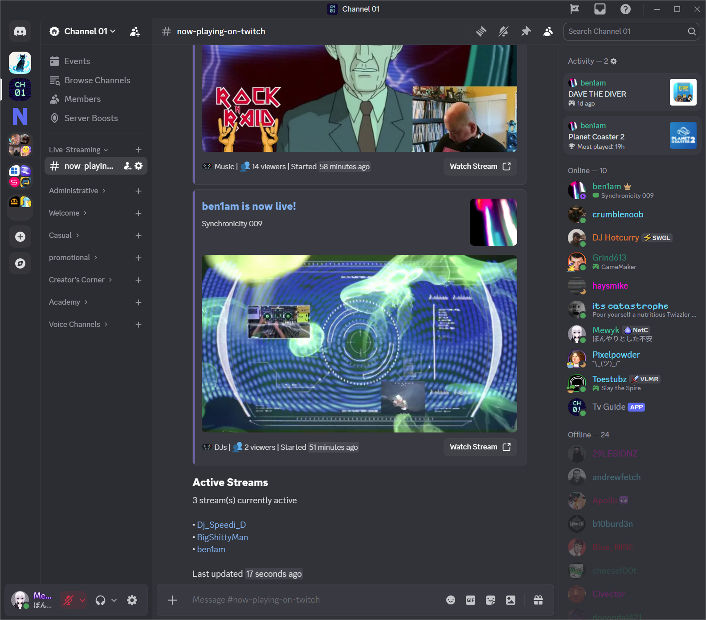

### Notice
> This repository is still a work in progress with many features and code improvements to come. More information to come in the readme soon!

# TvGuide
Discord bot written in C# (.NET 9) for automatically displaying and updating information about twitch streams based on added users.
> Original idea for the bot is from my beyond amazing friend, [DJ from the future - ben1am](https://www.twitch.tv/ben1am)!

### Desktop Screenshot - How it looks
> From the Discord server `Channel 01`.

### (Mobile) Screenshot - Adding a user
> From the Discord server `Channel 01`.

## Notes
- The only required library outside of Microsoft and .NET libraries, is [NetCord](https://netcord.dev/) Discord C# library.
- The twitch portion of the code only requires an "app access token" and thus does not require any user specific tokens to access data.
